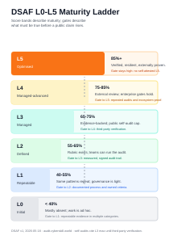
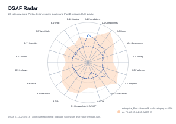

# DSAF — Design System Audit Framework

> Open-source criteria for auditing design-system maturity, producing a score, and turning the gaps into a phased improvement plan.
> Vendor-neutral, markdown-native, and designed for human reviewers working with LLM agents.

[](./LICENSE)
[](https://audit.cyberskill.world)

DSAF is a 125-criterion, agent-native, CMM-style maturity rubric for design systems. It gives you a score, a signed audit trail, and a fix plan that can be re-run by a second reviewer instead of disappearing into a consulting deck.

Why now: design systems have become operational infrastructure. They carry accessibility risk, performance budgets, contribution policy, adoption telemetry, and AI-agent rules, but there still is not a dominant open-source, criteria-graded maturity rubric on GitHub. The SaaS leaders, including zeroheight, Knapsack, and Supernova, are commercial platforms. The industry's best maturity narratives from Big Medium, Sparkbox, Brad Frost, and others are valuable, but they are mostly essays and checklists, not runnable audit artefacts.

How it differs: DSAF is criteria-graded, scriptable, and agent-native. Compared with SaaS platforms, it lives in your repo as markdown. Compared with Brad Frost's `frontend-guidelines-questionnaire`, it produces scored evidence, DSAF Levels, scripted checks, SCAN/FIX modes, and a no-silent-regression record.

<picture>
  <source srcset="./assets/dsaf-l0-l5-ladder-dark.svg" media="(prefers-color-scheme: dark)">
  
</picture>

<picture>
  <source srcset="./assets/dsaf-radar-dark.svg" media="(prefers-color-scheme: dark)">
  
</picture>

**Read DSAF-25 Core first.** If you only have 5 minutes, [`docs/dsaf-25.md`](./docs/dsaf-25.md) is the 25-criterion subset that fits on one page. The full DSAF Criteria are in [`docs/03-criteria-part-a.md`](./docs/03-criteria-part-a.md) and [`docs/04-criteria-part-b.md`](./docs/04-criteria-part-b.md).

## Quick Start

```bash
git clone https://github.com/cyberskill-official/design-system-audit-framework.git
cd design-system-audit-framework
npm install
npm run verify
node scripts/audit-init.mjs /path/to/your/design-system
```

Then open [`prompts/scan-mode.md`](./prompts/scan-mode.md), paste it into your LLM agent, and point the agent at:

- your target design-system repo, docs, tokens, Storybook, prior audits, and release notes;
- [`docs/dsaf-25.md`](./docs/dsaf-25.md) for the Core pass;
- [`docs/02-framework.md`](./docs/02-framework.md), [`docs/03-criteria-part-a.md`](./docs/03-criteria-part-a.md), and [`docs/04-criteria-part-b.md`](./docs/04-criteria-part-b.md) for the full pass.

The agent produces `audit-report-{YYYY-MM-DD}.md`. A human reviewer signs §4 before any FIX-mode work starts.

## What You Get

| Output | Where | Why it matters |
|---|---|---|
| DSAF-25 Core | [`docs/dsaf-25.md`](./docs/dsaf-25.md) | Five-minute first pass for leaders, PMs, and design-system owners |
| Full criteria | [`docs/03-criteria-part-a.md`](./docs/03-criteria-part-a.md), [`docs/04-criteria-part-b.md`](./docs/04-criteria-part-b.md) | 125 scored criteria across design-system quality and produced UX quality |
| Audit template | [`templates/audit-report-template.md`](./templates/audit-report-template.md) | Stable single-file audit output that humans and agents can both read |
| Prompt pack | [`prompts/`](./prompts/) | DSAF Modes for SCAN, FIX, research, and planning prompts for LLM-assisted audits |
| Verification scripts | [`scripts/`](./scripts/) | Link, coverage, bundle-size, doc-freshness, APCA, contract, and integration checks |
| Worked example | [`examples/cyberskill-design-system/`](./examples/cyberskill-design-system/) | Complete L3 self-audit example with its audit history preserved |
| Launch site | [`landing/`](./landing/) | Static public site deployed at [`audit.cyberskill.world`](https://audit.cyberskill.world) |

## Local Setup

Prerequisites:

- Node.js 20 or newer.
- npm 10 or newer.
- Optional: Vercel CLI if you deploy previews from your machine.
- Optional: a local static server such as `npx serve` or Python's built-in HTTP server.

Install and verify:

```bash
npm install
npm run check:links
npm run check:coverage
npm run check:bundle-size
npm run check:doc-freshness
npm run check:apca
npm run test:criteria-dedup-contract
npm run contract:criteria-dedup
npm run test:dsaf-25-contract
npm run contract:dsaf-25
npm run test:regression-contract
npm run contract:regression
npm run test:visual-assets-contract
npm run contract:visual-assets
npm run test:brand-taxonomy
npm run contract:brand-taxonomy
npm run test:domain-contract
npm run contract:domain
npm run contract:newsletter
npm run test:self-audit-contract
npm run contract:self-audit
npm run verify
```

Serve the public site locally:

```bash
python3 -m http.server 4173 -d landing
# open http://localhost:4173/
```

Or use Node tooling:

```bash
npx serve landing -l 4173
# open http://localhost:4173/
```

The landing site is static HTML/CSS/JS-free content, so opening [`landing/index.html`](./landing/index.html) directly also works for a quick visual check. Use the local server path when validating routes such as `/card`, `/blog/launch-2026`, `robots.txt`, `sitemap.xml`, and `/.well-known/security.txt`.

## Run An Audit

1. Prepare the target repo or docs folder. Include design tokens, component docs, Storybook exports, accessibility reports, changelog, adoption metrics, UX research, and prior audit material if available.
2. Bootstrap the target audit folder:

```bash
node scripts/audit-init.mjs /path/to/your/design-system
```

3. Paste [`prompts/scan-mode.md`](./prompts/scan-mode.md) into your LLM agent.
4. Ask the agent to read the target materials plus the DSAF docs listed in Quick Start.
5. Review the generated `audit-report-{YYYY-MM-DD}.md`.
6. Human reviewer signs §4 if the evidence and scoring are acceptable.
7. Paste [`prompts/fix-mode.md`](./prompts/fix-mode.md) only after §4 is signed.
8. Re-run relevant checks from `scripts/`, update the post-fix scores, and sign §9.
9. Append the audit history row to `_history.md` in the target repo.

Do not skip the human pause. SCAN mode can measure and recommend; FIX mode changes the target system only after explicit approval.

## Fine-Tune DSAF

Start with the defaults unless you have a real industry constraint. The safest path is a soft customisation layer in the target design-system repo:

```text
your-design-system/
└── _audit/
    ├── audit-report-2026-05-18.md
    ├── _history.md
    └── customisation.md
```

Use [`docs/09-customising.md`](./docs/09-customising.md) to document:

- category weights for Part A and Part B, while each part still sums to 100%;
- additional criteria with measurable 0 / 3 / 5 anchors;
- stricter rubric language for your market;
- anchor immutables for brand, voice, accessibility, and product constraints;
- extra lints or scripts for regulated contexts such as healthcare, fintech, HR tech, education, or govtech.

Keep these invariants intact: SCAN/FIX modes, the no-silent-regression rule, the §4 human pause, the 0-5 scoring scale, FIXED/DYNAMIC distinction, confidence ratings, and single-file audit output. If you change those, publish the result as a sibling methodology under a different name.

## Verification

Use `npm run verify` as the repo-level gate. It runs the safe checks for this repo:

```bash
npm run verify
```

Individual checks:

```bash
npm run check:links
npm run check:coverage
npm run check:bundle-size
npm run check:doc-freshness
npm run check:apca
npm run test:brand-taxonomy
npm run contract:brand-taxonomy
npm run test:domain-contract
npm run contract:domain
npm run contract:newsletter
npm run test:self-audit-contract
npm run contract:self-audit
npm run integ:storybook -- --input path/to/storybook-static
npm run integ:tokens -- --input path/to/tokens.json
npm run integ:zeroheight -- --input path/to/zeroheight-export.html
```

For the public site, use the deployment runbook:

```bash
curl -sI https://audit.cyberskill.world/ | grep -iE 'HTTP|strict-transport-security|content-security-policy'
curl -s https://audit.cyberskill.world/ | grep -E 'rel="canonical"|og:url|og:title'
curl -sI https://audit.cyberskill.world/card | head -1
curl -s https://audit.cyberskill.world/.well-known/security.txt
curl -s https://audit.cyberskill.world/robots.txt
curl -s https://audit.cyberskill.world/sitemap.xml | head -10
```

Record live deploy evidence with the template in [`docs/ops/deploy-runbook.md`](./docs/ops/deploy-runbook.md) when you run it.

`npm run contract:domain` is the FR-BRAND-001 live-domain gate. It checks `https://audit.cyberskill.world/`, HTTP-to-HTTPS redirect behavior, security headers, `security.txt`, robots, sitemap, DNS resolution, and the mock contract for private registrar/DNS/mail/HSTS-preload operations. It writes structured evidence to `docs/_audit/domain-contract.json`.

`npm run contract:dsaf-25` is the FR-CORE-001 Core subset gate. It verifies the 25 selected IDs, Part A/B category coverage, verbatim criterion names and tags against the full DSAF Criteria, inline public-card SVG requirements, print artefact bounds, the `dsaf_25_score` template field, and the mocked human-readability trial contract. It writes structured evidence to `docs/_audit/dsaf-25-contract.json`.

`npm run contract:criteria-dedup` is the FR-CORE-003 rubric stability gate. It verifies the live DSAF Criteria stay at 125 rows, all 20 category prefixes remain populated, merged-away IDs resolve to live primaries without alias chains or reuse, and DSAF-25/example surfaces do not cite aliases. It writes structured evidence to `docs/_audit/criteria-dedup-contract.json`.

`npm run contract:regression` is the FR-CORE-002 no-silent-regression gate. It verifies the policy, framework, FIX-cycle, DSAF Levels, template, and FIX prompt surfaces; checks the six allowed regression tags and four cause categories; blocks stale downgrade-rule wording outside explicit backward-compatibility text; and writes structured evidence to `docs/_audit/no-silent-regression-contract.json`.

`npm run contract:visual-assets` is the FR-BRAND-003 canonical-visual gate. It verifies ladder and radar SVG accessibility, viewBox/version metadata, file-size and PDF bounds, radar-template axes, README/docs references, and the mocked thumbnail-recognition trial contract. It writes structured evidence to `docs/_audit/visual-assets-contract.json`.

`npm run contract:decoupling` is the FR-BRAND-004 content-layer decoupling gate. It verifies the `audit.cyberskill.world` canonical-host override, historical no-redirect posture, landing-page sales-copy boundary, CODEOWNERS gates, active-surface neutral-domain cleanup, and the mocked deployment-control contract. It writes structured evidence to `docs/_audit/decoupling-contract.json`.

`npm run contract:readme` is the FR-DOCS-001 launch-copy gate. It verifies the first-200-word pitch, above-the-fold visual embeds, DSAF-25 cross-link, Quick Start, Reading Order, endorsement placeholders, banned funnel copy, handle taxonomy, and the mocked colleague-skim contract. It writes structured evidence to `docs/_audit/readme-contract.json`.

`npm run contract:reviewers` is the FR-GOV-001 reviewer-outreach gate. It verifies the 10-person shortlist, review-not-endorsement playbook, top-three outreach drafts, consent-log guard, README placeholders, and mocked personal-email outreach boundary. It writes structured evidence to `docs/_audit/reviewer-contract.json`.

`npm run contract:endorsements` is the FR-DOCS-002 consent gate. It verifies that README endorsement placeholders remain honest while consent is empty, pending quotes contain no invented praise, shortlist quote statuses are not prematurely approved/published, and the mocked quote-approval contract keeps publication blocked. It writes structured evidence to `docs/_audit/endorsement-contract.json`.

`npm run contract:launch-blog` is the FR-DOCS-003 launch-post gate. It verifies the launch post frontmatter, candid sections, no-funnel copy, visual embeds, rendered HTML, OG assets, blog index, and mocked production deploy/quote dependency. It writes structured evidence to `docs/_audit/launch-blog-contract.json`.

## Deploy Strategy

The public site is deployed from [`landing/`](./landing/) to Vercel. The canonical host is [`https://audit.cyberskill.world/`](https://audit.cyberskill.world/), per [`docs/branding/domain-decision.md`](./docs/branding/domain-decision.md).

Local deploy preview:

```bash
python3 -m http.server 4173 -d landing
open http://localhost:4173/
```

Production strategy:

1. Land changes on a PR.
2. Run `npm run verify`.
3. Run the landing route smoke checks from [`docs/ops/deploy-runbook.md`](./docs/ops/deploy-runbook.md).
4. Review Vercel preview output, especially `/`, `/card`, `/blog/launch-2026`, and `/blog/co-maintainer-announcement`.
5. Merge to `main`; Vercel deploys production.
6. Re-run the runbook checks against production.
7. Capture Lighthouse evidence and keep all four pillars at 95 or higher.

Security headers, cache policy, robots, sitemap, and `security.txt` live in [`landing/vercel.json`](./landing/vercel.json), [`landing/robots.txt`](./landing/robots.txt), [`landing/sitemap.xml`](./landing/sitemap.xml), and [`landing/.well-known/security.txt`](./landing/.well-known/security.txt).

## Social Launch Handoff

Social-platform work is manual because it depends on accounts, platform timing, and human replies. The ready-to-post content and schedule live in [`docs/social/`](./docs/social/):

- [`docs/social/show-hn.md`](./docs/social/show-hn.md) — Show HN title, body, first comment, response rules.
- [`docs/social/cross-posts.md`](./docs/social/cross-posts.md) — Reddit, Lobste.rs, daily.dev, and Designer News sequencing.
- [`docs/social/product-hunt.md`](./docs/social/product-hunt.md) — Product Hunt assets and launch-day runbook.
- [`docs/social/personal-outreach.md`](./docs/social/personal-outreach.md) — ten named personal outreach drafts.
- [`docs/social/reviewer-outreach.md`](./docs/social/reviewer-outreach.md) — outside-reviewer requests and consent flow.
- [`docs/social/guest-post-pitches.md`](./docs/social/guest-post-pitches.md) — Smashing Magazine, CSS-Tricks, and A List Apart pitches.
- [`docs/social/newsletter-submissions.md`](./docs/social/newsletter-submissions.md) — newsletter submission copy and cadence.
- [`docs/social/FR-LAUNCH-006-social-payload.json`](./docs/social/FR-LAUNCH-006-social-payload.json) — newsletter mock-service request/response contract.

Use [`docs/EXECUTION_PLAN.md`](./docs/EXECUTION_PLAN.md) as the operator checklist. Anything that requires posting, emailing, quote consent, account access, or HSTS preload submission is marked as operator-owned there.

## Maturity Levels

| Level | Combined score | Meaning |
|---|---:|---|
| L0 Initial | < 40% | Ad-hoc, project-by-project |
| L1 Repeatable | 40-55% | Some reusable patterns |
| L2 Defined | 55-65% | Documented, named owners, basic tokens |
| L3 Managed | 65-75% | Versioned, CI-aware, telemetry starting |
| L4 Managed advanced | 75-85% | Multi-platform, governed, measured |
| L5 (Optimised) | 85%+ | Externally validated, community-proven, AI-native |

Published self-audits cap at L3 without third-party verification. See the [self-audit publication policy](./docs/branding/self-audit-policy.md).

## Reading Order

| # | File | Purpose |
|---|---|---|
| 1 | [`docs/01-introduction.md`](./docs/01-introduction.md) | Extended introduction, audience, output shape |
| 2 | [`docs/02-framework.md`](./docs/02-framework.md) | Modes, actors, scoring, and no-silent-regression |
| 3 | [`docs/dsaf-25.md`](./docs/dsaf-25.md) | DSAF-25 Core, the one-page entry point |
| 4 | [`docs/05-running-an-audit.md`](./docs/05-running-an-audit.md) | Step-by-step audit workflow |
| 5 | [`docs/07-maturity-tiers.md`](./docs/07-maturity-tiers.md) | What each DSAF Level means |
| 6 | [`prompts/scan-mode.md`](./prompts/scan-mode.md) | Paste this into your LLM for the first SCAN |
| 7 | [`docs/08-improvement-plan.md`](./docs/08-improvement-plan.md) | Turn findings into a phased improvement plan |

For the prompt pack overview, read [`docs/10-prompt-pack.md`](./docs/10-prompt-pack.md).

The repo-shipped lite benchmark lives at [`landing/benchmark/index.html`](./landing/benchmark/index.html) with the canonical spec at [`docs/bench/lite-benchmark-spec.md`](./docs/bench/lite-benchmark-spec.md). Production collection requires a GDPR-compliant form vendor ID; the local version is a working sandbox and stores only in browser session storage.

## External Review Status

Named outside-reviewer quotes are not published until explicit written consent is logged. The outreach materials are in [`docs/social/reviewer-outreach.md`](./docs/social/reviewer-outreach.md), the shortlist is in [`docs/branding/reviewer-shortlist.md`](./docs/branding/reviewer-shortlist.md), and the consent log is in [`docs/branding/reviewer-consent-log.md`](./docs/branding/reviewer-consent-log.md).

> "<endorsement quote, <= 280 chars>" — <Reviewer Name>, <Affiliation>

> "<endorsement quote, <= 280 chars>" — <Reviewer Name>, <Affiliation>

These slots are placeholders for FR-DOCS-002. Do not replace them with invented praise.

## Governance

DSAF is maintained in the open.
Current maintainer list:

| Maintainer | Role | Bio |
|---|---|---|
| Stephen Cheng | Founder and original maintainer | Vietnam-based founder of CyberSkill; accountable for the original DSAF rubric, examples, launch materials, and repository stewardship. |
| Co-maintainer seat | Open, FR-GOV-002 | The role charter is published in [`docs/governance/co-maintainer-charter.md`](./docs/governance/co-maintainer-charter.md). Candidates are not publicly attributed until written acceptance and co-signed announcement. |

CyberSkill is the original authoring practice, not the sole intended governance structure.

Substantive criteria changes should open an issue first. Architecture changes use the governance/RFC path. Translation work starts with [`docs/i18n/good-first-issues.md`](./docs/i18n/good-first-issues.md).

## Commercial Work

The DSAF repo is free and self-serve. CyberSkill's commercial audit and implementation services are documented separately in [`SERVICES.md`](./SERVICES.md) so the methodology surface stays neutral.

## Contributing

Read [`CONTRIBUTING.md`](./CONTRIBUTING.md). Small edits can open a PR directly; larger changes should include rationale, affected criteria, expected verification, and migration notes for existing audits.

## License

[MIT](./LICENSE). Use it commercially, adapt it, and run it against competitors' systems. Attribution is appreciated.

*Built by CyberSkill. Public methodology, stable URL, reusable rubric.*
