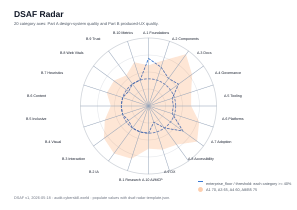

# DSAF — Design System Audit Framework

DSAF is an open-source, agent-native, 125-criterion audit toolkit that scores any design system against a CMM-style maturity rubric spanning six levels. It ships a criteria-graded maturity rubric you can run in under 5 minutes with the [DSAF Criteria](docs/framework/dsaf-25.md) quick-start subset, or expand to the full 125-row rubric for a comprehensive evaluation.

**Why now.** Commercial platforms like zeroheight, Knapsack, and Supernova offer hosted dashboards but lock methodology behind a paywall. Community efforts like frontend-guidelines-questionnaire provide useful checklists but stop short of a scoring model. DSAF fills the gap: a repo-native, scriptable, open-source audit with a transparent scoring engine designed for human reviewers working alongside LLM agents.

**How it differs.** Compared with SaaS platforms that bundle auditing into a subscription, DSAF keeps the methodology surface stays neutral and open. It is not a linter, not a checklist essay, and not a vendor pitch. The DSAF-25 Core gives you a fast entry point; the full rubric gives depth.

<picture>
  <source media="(prefers-color-scheme: dark)" srcset="docs/framework/assets/dsaf-l0-l5-ladder-dark.svg">
  
</picture>

<picture>
  <source media="(prefers-color-scheme: dark)" srcset="docs/framework/assets/dsaf-radar-dark.svg">
  
</picture>

## Quick Start

```bash
git clone https://github.com/cyberskill-official/design-system-audit-framework.git
cd design-system-audit-framework
npm run verify
node framework/scripts/bin/audit-init.mjs
```

Open [docs/guidelines/prompts/scan-mode.md](docs/guidelines/prompts/scan-mode.md) in your LLM and run your first SCAN.

## Reading Order

| # | Document | Purpose |
|---|----------|---------|
| 1 | [Introduction](docs/guidelines/01-introduction.md) | What DSAF is, who it is for, and what you will produce |
| 2 | [Framework](docs/framework/02-framework.md) | DSAF Modes (SCAN/FIX modes), actors, scoring, the no-silent-regression rule |
| 3 | [DSAF-25 Core](docs/framework/dsaf-25.md) | The 25-row quick rubric — start here before the full 125 |
| 4 | [Running an Audit](docs/guidelines/05-running-an-audit.md) | Step-by-step playbook for your first audit |
| 5 | [Maturity Tiers](docs/framework/07-maturity-tiers.md) | What each DSAF Levels tier means (L0–L5) |
| 6 | [Scan Mode Prompt](docs/guidelines/prompts/scan-mode.md) | Paste this prompt into your LLM agent to run a SCAN |
| 7 | [Improvement Plan](docs/guidelines/08-improvement-plan.md) | Turn audit findings into a phased improvement roadmap |

## DSAF Criteria Overview

DSAF scores a design system across 20 categories — 10 covering the system itself (tokens, components, governance, distribution, accessibility, performance, AI readiness) and 10 covering the UX it produces (research, IA, interaction, content, heuristics, measurement, ethics). Each criterion is scored 0–5. The DSAF Levels ladder maps aggregate scores to maturity tiers: L0 (Ad-hoc) through L5 (Optimising).

The DSAF-25 Core is the fast-track subset: 25 criteria selected to give a reliable maturity signal in a single sitting. Run it first; expand to the full rubric when you need depth.

## Self-Audit Example

Complete L3 self-audit example: see [`examples/cyberskill-design-system/`](docs/framework/examples/cyberskill-design-system/). This example follows the self-audit publication policy — without third-party verification the publicly cited level caps at L3.

## Monetisation Transparency

DSAF is open-source. The methodology surface stays neutral and free. Commercial services (consulting, training, hosted tooling) are described separately in [`docs/internal/strategy/framework-monetization-plan.md`](docs/internal/strategy/framework-monetization-plan.md). The open methodology never gates on a purchase.

## Endorsements

> "<endorsement quote — slot reserved for outside reviewer #1>"

> "<endorsement quote — slot reserved for outside reviewer #2>"

Named outside-reviewer quotes are not published until explicit written consent is logged.
Do not replace them with invented praise.
See [`docs/internal/branding/reviewer-shortlist.md`](docs/internal/branding/reviewer-shortlist.md) and [`docs/internal/branding/reviewer-consent-log.md`](docs/internal/branding/reviewer-consent-log.md) for the consent registry.


## Contract Checks

Run `npm run verify` to execute all contracts. Individual contracts:

- `npm run contract:regression` / `npm run test:regression-contract`
- `npm run contract:visual-assets` / `npm run test:visual-assets-contract`
- `npm run contract:criteria-dedup` / `npm run test:criteria-dedup-contract`
- `npm run contract:dsaf-25` / `npm run test:dsaf-25-contract`
- `npm run contract:readme` / `npm run test:readme-contract`
- `npm run contract:reviewers` / `npm run test:reviewer-contract`

## Canonical Surface

The public-facing instance is deployed at https://audit.cyberskill.world.

## License

MIT License — Copyright (c) CyberSkill.
