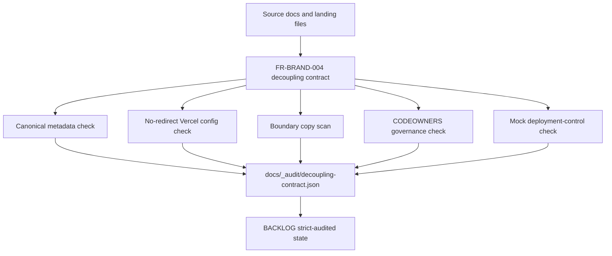

# ADR-FR-BRAND-004: Content-layer decoupling on the canonical CyberSkill host

**Status:** accepted and self-approved, 2026-05-18  
**FR:** FR-BRAND-004  
**Decision owner:** Zero-touch strict audit pass

## Context

FR-BRAND-004 originally required moving framework marketing from `audit.cyberskill.world` to `dsaf.dev` and installing path-preserving 301 redirects for at least 12 months. The current repository state already contains an operator override: `audit.cyberskill.world` is the canonical public host, `dsaf.dev` is not being pursued, and brand separation is enforced by copy, routing, and governance boundaries.

The strict audit therefore must not install redirects to a non-canonical domain. Doing so would create a redirect race and could send users away from the live source of truth.

## Decision

Keep `https://audit.cyberskill.world/` as the canonical DSAF host. Treat the original neutral-domain migration as historical. Enforce decoupling through these gates:

- Active public surfaces use `audit.cyberskill.world` as canonical.
- `landing/vercel.json` contains no redirect or rewrite rules for the neutral-domain plan.
- Landing pages do not carry paid audit, pricing, or sales-form CTAs.
- Paid-services breadcrumbs route to `SERVICES.md`, not landing-page sales copy.
- Boundary docs are CODEOWNERS-gated.
- External deployment-control evidence is isolated behind a mock contract because it requires operator credentials.

## Data flow

## Consequences

The FR is shipped as `strict-audited + mocked-dependency`: repo-verifiable boundaries are strict, while live deployment and historical edge-control-plane proof remain mocked because they require credentials outside the repository. If named reviewers later cite the CyberSkill subdomain as a credibility issue, the neutral-domain migration should be re-batched as a new FR rather than silently reviving the old redirect plan.

## Edge-case matrix

| Case | Risk | Handling |
|---|---|---|
| Active surface links to `dsaf.dev` | Split canonical story | Fail contract |
| Redirects appear in `landing/vercel.json` | Canonical-host race | Fail contract |
| Landing gains sales copy | DSAF becomes a funnel | Fail contract |
| CODEOWNERS gate removed | Future boundary drift | Fail contract |
| Deployment-control proof unavailable | Fabricated evidence | Mock exact request/response shape |

