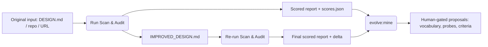

# Self-Improving Feedback Loop Guidelines

This document details the architecture, execution flow, honesty guards, and criteria-evolution standards for the DSAF Self-Improving Feedback Loop.

---

## 1. Loop Architecture & Mechanism

The feedback loop is a closed-cycle verification mechanism designed to continuously calibrate, improve, and validate design system doctrines using the framework's own audit engine. DSAF treats doctrine improvement as a multi-stage compilation flow:



### The Two-Iteration Workflow

For any target design system:

1. **Iteration 1 (Scan & Improve)**:
   - The engine parses the input (a `DESIGN.md` file, a repository tree, or a public URL crawl).
   - It scores the canonical **125 DSAF criteria** with the three-band evidence model and produces `ANALYZED_DESIGN_REPORT.md` plus machine-readable `scores.json`.
   - It generates a restructured `IMPROVED_DESIGN.md` embedding the automatable doctrine requirements for missing criteria.
2. **Iteration 2 (Verify & Calibrate)**:
   - `IMPROVED_DESIGN.md` from Iteration 1 is fed back as the next input.
   - The engine re-audits and logs the score delta, verifying the improved doctrine is structurally sound.

### Honesty guards (why the loop cannot game itself)

The engine scores every criterion in three bands:

| Band | Max | Evidence class | Rubric anchor parity |
|---|---:|---|---|
| Mentions | 40 | prose keyword coverage (synonym-aware) | 1 Mentioned / 2 Defined |
| Artifacts | 40 | real files and configs found by structural probes | 3 Built |
| Verification | 20 | CI + tests + generated check outputs | 4 Measured |

Because re-feeding `IMPROVED_DESIGN.md` can only ever recover the prose band, the loop converges quickly and **cannot inflate scores by keyword echo** — artifacts and verification demand real files, CI, and tests in the target. `check-engine-robustness` pins the prose-only cap (≤ 40/100) so this guard cannot silently regress.

---

## 2. Running the Loop

### Running the exploratory cases

```bash
npm run audit:maximal:cases
```

This coordinates:
- Downloading remote doctrine fixtures (Airbnb, Apple, Figma, Linear, Notion, Cursor, IBM).
- Optional machine-local cases from `scripts/test/fixtures/local-cases.json` (or `DSAF_LOCAL_CASES`); missing paths are skipped with a warning so the loop runs on any machine.
- Public URL crawls and shallow repository clones (network-dependent).
- The iterative feedback loop per case, with per-iteration band breakdowns.

### Checking hermetic loop output

```bash
npm run verify          # includes gen:verification-cases + check:maximal:cases
```

The hermetic verification corpus (vendored fixtures, no network) regenerates under `docs/outputs/generated/verification-cases`; the check validates report structure AND `scores.json` (schema `dsaf-scores/1`, 125 criteria, in-range averages).

### Mining evolution proposals

```bash
npm run evolve:mine
```

Aggregates `scores.json` across all cases and writes to `docs/outputs/generated/evolution/`:
- **dead criteria** (score 0 everywhere — vocabulary/probe gaps or corpus gaps),
- **saturated criteria** (100 everywhere — no discrimination left),
- **universal keyword misses** (synonym candidates for the engine's `SYNONYMS` map),
- **artifact probe gaps** (categories whose probes never fire on repo-mode cases).

**The miner never mutates the rubric.** Proposals become changes only through a human-reviewed PR, with a `dsaf_125_version` bump when criteria rows change. The weekly `self-evolution.yml` workflow runs verify + mine and uploads the proposals as reviewable artifacts.

---

## 3. Criteria Expansion Guidelines

DSAF criteria grow systematically to cover the complex, multi-layered requirements of large enterprise software and automation. Developers extending the rubric should follow these principles:

### A. Level Calibration
Every new criterion must be mapped to one of the six DSAF Levels:
- **L0 (Initial)**: Missing definitions, ad-hoc configurations, or raw visual assets without code synchronization.
- **L1 (Repeatable)**: Simple baseline variables, partial layout guidelines, or standard color scales.
- **L2 (Defined)**: Fully documented tokens, component coverage for core elements, and basic responsive layouts.
- **L3 (Managed)**: Structured design-system operations, light/dark mode parity, automated unit checks, and public self-audit validation.
- **L4 (Advanced)**: Comprehensive automation, multi-platform translation (iOS, Android, React Native), high-contrast accessibility modes, and telemetry dashboards.
- **L5 (Optimized)**: Deeply automated agentic access policies, autonomous conformance agents, zero-drift code-to-figma parity, and third-party verified standards compliance.

### B. Defining AUTO vs. MANUAL checks
- **AUTO**: The requirement can be verified algorithmically by scanning the repository structure, code files, token JSONs, or headers (e.g., matching a token structure, checking for HSTS headers, or verifying bundle-size logs).
- **MANUAL**: The requirement requires human validation or external verification (e.g., manual screen-reader testing on VoiceOver, user-research validation interviews, or legal counsel reviews).

### C. Preventing Regression
When adding new rules to the criteria, verify that:
- It maps to a specific category and has a descriptive title.
- It includes defined `Evidence found` and `Required proof` triggers.
- It has no commercial upsells or services text embedded, maintaining DSAF's vendor-neutral public-first posture.
- `dsaf_125_version` is bumped and the calibration corpus regenerated (`npm run verify`) in the same change.

---
*Maintained under DSAF guidelines.*
