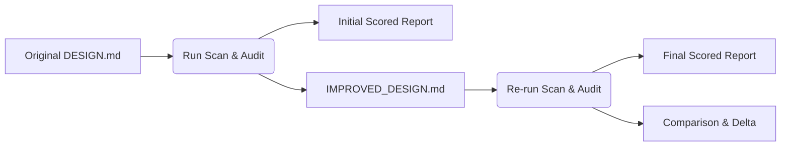

# Self-Improving Feedback Loop Guidelines

This document details the architecture, execution flow, and criteria expansion standards for the DSAF Self-Improving Feedback Loop.

---

## 1. Loop Architecture & Mechanism

The feedback loop is a closed-cycle verification mechanism designed to continuously calibrate, improve, and validate design system doctrines using the framework's own audit engine. Rather than a static checklist, DSAF treats doctrine improvement as a multi-stage compilation flow:



### The Two-Iteration Workflow

For any target design system (e.g., `cyberskill-design-system`):
1. **Iteration 1 (Scan & Improve)**:
   - The framework crawls or parses the original input structure (a `DESIGN.md` file or public URL).
   - It runs against the maximal enterprise criteria table (371+ criteria) to produce the first-pass `ANALYZED_DESIGN_REPORT.md`.
   - Simultaneously, it generates a restructured `IMPROVED_DESIGN.md` that embeds recommended doctrine sections, tokens, and automated rules matching missing criteria.
2. **Iteration 2 (Verify & Calibrate)**:
   - The output `IMPROVED_DESIGN.md` from Iteration 1 is fed back into the runner as the direct input.
   - The framework re-audits this improved design.
   - It compares the score of Iteration 2 against Iteration 1, logging the score difference (Delta) and ensuring the new doctrine is syntactically sound and satisfies the automated checks.

---

## 2. Running the Loop

The loop is fully automated and integrated into the framework's testing scripts.

### Running all 10 Real Cases
To run the loop across the 10 real design system cases:
```bash
npm run audit:maximal:cases
```

This coordinates:
- Downloading remote design fixtures (Airbnb, Apple, Figma, Linear, Notion, Cursor, IBM).
- Executing the two-iteration feedback loop for all 10 cases.
- Patching path references deterministic mapping.
- Clearing out-of-band temporary directories.

### Checking loop output verification
```bash
npm run check:maximal:cases
```
This script verifies that all 10 directories are structured correctly with `ANALYZED_DESIGN_REPORT.md` and `IMPROVED_DESIGN.md`, and that they meet all automated criteria validation gates.

---

## 3. Criteria Expansion Guidelines

DSAF criteria grow systematically to cover the complex, multi-layered requirements of large enterprise software and automation. Developers extending the rubric should follow these principles:

### A. Level Calibration
Every new criterion must be mapped to one of the six DSAF Levels:
- **L0 (Initial)**: Missing definitions, ad-hoc configurations, or raw visual assets without code synchronization.
- **L1 (Repeatable)**: Simple baseline variables, partial layout guidelines, or standard color scales.
- **L2 (Defined)**: Fully documented tokens, component coverage for core elements, and basic responsive layouts.
- **L3 (Managed)**: Structured design-system operations, light/dark mode parity, automated unit checks, and public self-audit validation.
- **L4 (Advanced)**: Comprehensive automation, multi-platform translation (iOS, Android, React Native), high-contrast accessibility modes, and telemetry dashboards.
- **L5 (Optimized)**: Deeply automated agentic access policies, autonomous conformance agents, zero-drift code-to-figma parity, and third-party verified standards compliance.

### B. Defining AUTO vs. MANUAL checks
- **AUTO**: The requirement can be verified algorithmically by scanning the repository structure, code files, token JSONs, or headers (e.g., matching a token structure, checking for HSTS headers, or verifying bundle-size logs).
- **MANUAL**: The requirement requires human validation or external verification (e.g., manual screen-reader testing on VoiceOver, user-research validation interviews, or legal counsel reviews).

### C. Preventing Regression
When adding new rules to the maximal enterprise criteria, verify that:
- It maps to a specific category and has a descriptive title.
- It includes defined `Evidence found` and `Required proof` triggers.
- It has no commercial upsells or services text embedded, maintaining DSAF's vendor-neutral public-first posture.

---
*Maintained under DSAF guidelines.*
